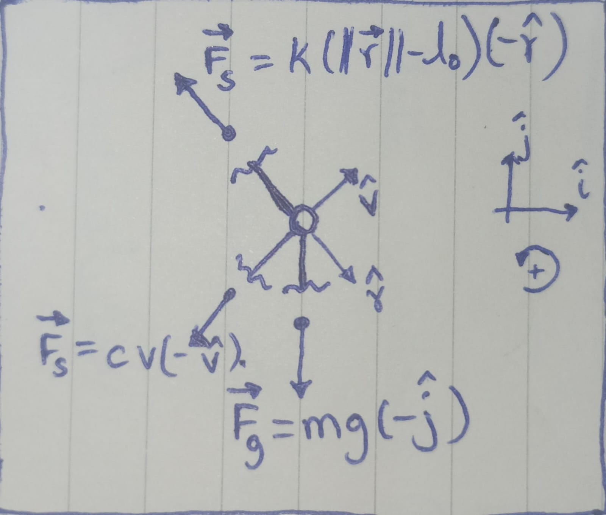
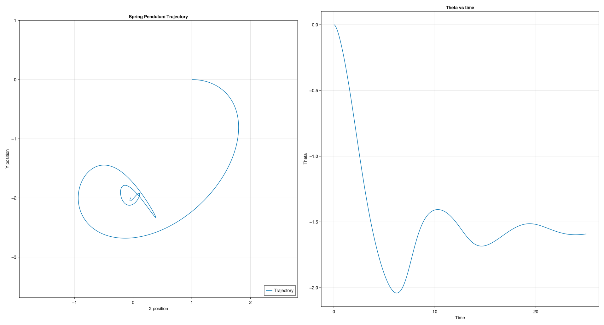
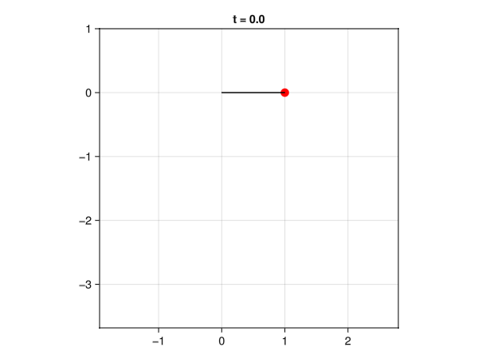

> 1. Set up (define system, draw FBD, write ODEs) a particle problem. Just one particle. 2D or 3D, your choice. Use a force, or forces that you like (gravity, spring, air friction). Any example of interest. Find a numerical solution. Graph it. Animate it. Try to make an interesting observation.

# System Description and Free Body Diagram

I think I have chosen a just hard enough interesting problem. A spring pendulum consists of a mass $m$ attached to a spring of natural length $l_0$ and spring constant $k$. 

The system experiences:
- Spring force $\vec{F_s} = k(\|{\vec{r}\|}-l_0)(-\hat{r})$
- Gravitational force $\vec{F_g} = mg(-\hat{j})$
- Damping force $\vec{F_d} = cv(-\hat{v})$



# Equations of Motion

In Cartesian coordinates, the equations of motion are:

$$\dot{\vec{r}} = \vec{v}$$
$$\dot{\vec{v}} = -k(\|\vec{r}\|-l_0) \hat{r} - c \vec{v} - mg\hat{j}$$

The corresponding code for the ODE in file [./SpringPendulum/src/Physics.jl](./SpringPendulum/src/Physics.jl):

```julia
module Physics

using ..Parameters
using LinearAlgebra
using UnPack

export spring_pendulum!

function spring_pendulum!(du, u, p::Parameters.Param, t)
    @unpack mass, gravity, stiffness, restinglen, viscosity = p

    r⃗ = u[1:2]
    v⃗ = u[3:4]

    ĵ = [0.0; 1.0]
    gravity = mass * gravity * (-ĵ)
    spring = stiffness * (norm(r⃗) - restinglen) * (-normalize(r⃗))
    drag = -viscosity * v⃗

    force = (spring + drag + gravity)

    du[1:2] = v⃗
    du[3:4] = force / mass
end

end
```

# Numerical Solution

In file [./SpringPendulum/src/SpringPendulum.jl](./SpringPendulum/src/SpringPendulum.jl)

```julia
module SpringPendulum

using DifferentialEquations

include("Parameters.jl")
include("Physics.jl")
include("Visualization.jl")

# problem setup
x₀, y₀ = (1, 0)
r₀ = [x₀;y₀]
v₀ = [1.0;0.0]
u₀ = [r₀;v₀]
tspan = (0.0,25.0)
p = Parameters.Param(m=1,g=1,c=0.0,k=1,l₀=0)
prob = ODEProblem(Physics.spring_pendulum!, u₀, tspan, p)

# solver
Δt = 0.001
sol = solve(prob, saveat=Δt, reltol=1e-6, abstol=1e-6)

# visualize
# ...

end # module SpringPendulum
```

# Phase Space Trajectory

Plot showing the system evolution in phase space. In file [./SpringPendulum/src/Visualization.jl](./SpringPendulum/src/Visualization.jl):



Code corresponding to this in file [SpringPendulum/src/Visualization.jl](SpringPendulum/src/Visualization.jl):

```julia
function plot_trajectory(sol; title="Spring Pendulum Trajectory")
    a = reduce(hcat, sol.u)'
    x =  a[:, 1]
    y = a[:, 2]
    θ = atan.(a[:, 2], a[:, 1])

    xlimits = (minimum(x)-1, maximum(x)+1)
    ylimits = (minimum(y)-1, maximum(y)+1)

    trajectory_plot = Figure()
    trajectory = Axis(trajectory_plot[1, 1],
        title=title,
        xlabel="X position",
        ylabel="Y position",
        limits=(xlimits, ylimits),
        aspect=1,
    )
    lines!(trajectory, x, y,
        label="Trajectory",
    )
    axislegend(position=:rb)

    trajectory = Axis(trajectory_plot[1, 2],
        title="Theta vs time",
        xlabel="Time",
        ylabel="Theta",
    )
    lines!(trajectory, sol.t, θ)

    return trajectory_plot
end
```

# Animation
The following shows the animation for the solution system. The code corresponding to this animation:

TODO: add springs to visualise



The code corresponding to this animation is in file [./SpringPendulum/src/Visualization.jl](./SpringPendulum/src/Visualization.jl):

```julia
function makie_animation(sol; filename="sol_animation.gif", title="Animation")
    sol_matrix = reduce(hcat, sol.u)'
    x =  sol_matrix[:, 1]
    y = sol_matrix[:, 2]
    θ = atan.(sol_matrix[:, 2], sol_matrix[:, 1])

    # coarse boundaries, for continuous(interpolated) boundary see: https://docs.sciml.ai/DiffEqDocs/stable/examples/min_and_max/
    xlimits = (minimum(x)-1, maximum(x)+1)
    ylimits = (minimum(y)-1, maximum(y)+1)

    time = Observable(0.0)

    x = @lift(sol($time)[1])
    y = @lift(sol($time)[2])

    # Create observables for line coordinates
    line_x = @lift([0, $x])
    line_y = @lift([0, $y])

    animation = Figure()
    ax = Axis(animation[1, 1], title = @lift("t = $(round($time, digits = 1))"), limits=(xlimits, ylimits), aspect=1)

    scatter!(ax, x, y, color=:red, markersize = 15)
    lines!(ax, line_x, line_y, color=:black)

    framerate = 30
    timestamps = range(0, last(sol.t), step=1/framerate)

    record(animation, filename, timestamps;
            framerate = framerate) do t
        time[] = t
    end

    return animation
end
```

# Observations

1. Energy exchange between potential and kinetic forms
2. Damped oscillations due to viscous friction
3. For some parameters there is weird behaviour at very small scales. This is probably an artifact of the solver and floating point truncations. I was unable to reproduce this, but I had shown this to Professor Andy and Ganesh Bhaiya.
4. Increasing `c` by a little has a drastic effect
5. The problem was fun to simulate
6. Julia was fun to code in: Libraries were ergonomic to use, DifferentialEquations.jl, and Makie.jl
7. I noticed only much later that all of the trajectories for when resting length is zero are elipses.
