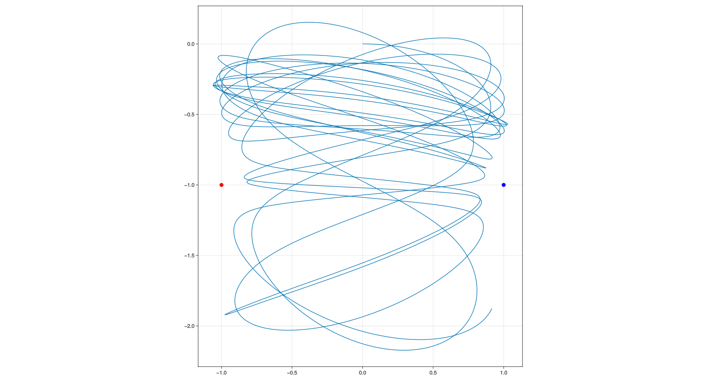
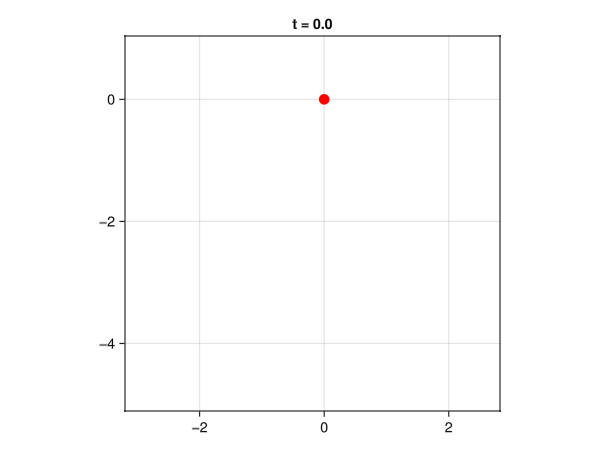
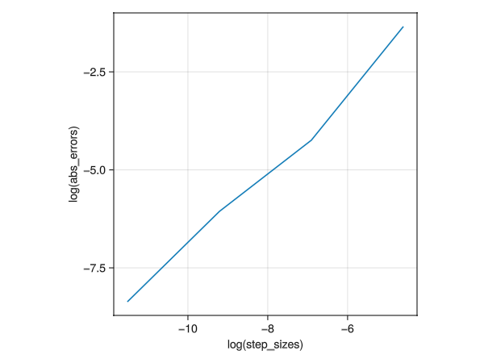

> 3\. More ODE & animation practice. Take a simple set of ODEs. Use a set you like,e.g., harmonic oscillator, non-linear pendulum, the Lorentz system (look it up on the internet). Solve this set numerically 3 ways (see below), and understand the accuracy. The goal is that, by the time you hand in the homework, you can write and debug the assignment on your own without looking up anything (outside of trivial syntax things). And you always have a good sense of the accuracy of your solution.  
> 
>     a. Method 1: as simply as possible, without ODE45, and without calling functions or anything like that. A single function or script file with no function calls (ok, plotting calls are ok). Just write a simple loop that implements Euler’s method with your ODE.  
>     b. With your own Euler solver function. Your main program should call your Euler solver. Your Euler solver should call a RHS (Right Hand Side) function.  
>     c. With ODE45.  
>     d. Using (b), solve the equations many times with progressively smaller step size, down to the smallest size you have patience for, and up to the largest size that isn’t crazy. As sensibly as possible, compare the results and use that comparison to estimate the accuracy of each solution. You should be able to find a method to estimate the accuracy of a numerical solution even without knowing the exact solution.  
>     e. Using ODE45, solve the equations with various accuracies (use ’reltol’ and ’abstol’, note MATLAB satisfies one or the other, whichever is easiest. So, if you want an accurate solution you need to make both ’reltol’ and ’abstol’ small). Does Matlab do a good job of estimating its own accuracy? Use suitable plots to make your point.  

# a. Write a single file or function write eulers method

In file [./ODESolvers/procedural.jl](./ODESolvers/procedural.jl):

```julia
#!/usr/bin/env julia

import GLMakie  # for plotting
import LinearAlgebra  # for norm

# Type definitions, for readability
ODE_Function = Function
Time = Float64
Tspan = Tuple{Time,Time}
State = Vector{Float64}
struct Param
    r₁
    k₁
    l₁
    r₂
    k₂
    l₂
    m
    g
end
struct Prob
    ode::ODE_Function
    u₀::State
    tspan::Tspan
    p::Param
end
Solution = Vector{State}

# Physics/ODEs describing the system
function two_spring_pendulum(u::State, p::Param, t::Time)
    r = u[1:2]
    v = u[3:4]

    r₁ = p.r₁
    k₁ = p.k₁
    l₁ = p.l₁
    r₂ = p.r₂
    k₂ = p.k₂
    l₂ = p.l₂

    m = p.m
    g = p.g

    j = [0; 1]

    seperation1 = (r - r₁)
    spring1 = k₁ * (LinearAlgebra.norm(seperation1) - l₁) * -LinearAlgebra.normalize(seperation1)
    seperation2 = (r - r₂)
    spring2 = k₂ * (LinearAlgebra.norm(seperation2) - l₂) * -LinearAlgebra.normalize(seperation2)
    gravity = m * g * -j

    F = (1 / m) * (spring1 + spring2 + gravity)

    u_new = [0.0; 0; 0; 0]
    u_new[1:2] = v
    u_new[3:4] = F / m

    return u_new
end


# Plotting function
function plot_trajectory_makie(sol::Solution, prob::Prob)::GLMakie.Figure
    # Convert solution to matrix form
    sol_matrix = reduce(hcat, sol)'

    # Create figure
    fig = GLMakie.Figure()
    ax = GLMakie.Axis(fig[1, 1], aspect=GLMakie.DataAspect())

    # Plot trajectory
    GLMakie.lines!(ax, sol_matrix[:, 1], sol_matrix[:, 2])

    # Plot reference points
    r₁, r₂ = prob.p.r₁, prob.p.r₂
    GLMakie.scatter!(ax, [r₁[1]], [r₁[2]], color=:red, markersize=15)
    GLMakie.scatter!(ax, [r₂[1]], [r₂[2]], color=:blue, markersize=15)

    # Display the figure
    return fig
end

# Problem Setup
(x₀, y₀) = (0.0, 0.0)
r₀ = [x₀; y₀]
v₀ = [1.0, 0.0]
u₀ = [r₀; v₀]

tspan = (0.0, 100.0)

r₁, k₁, l₁ = [-1.0, -1.0], 1, 1
r₂, k₂, l₂ = [1.0, -1.0], 1, 1
m, g = 1.0, 0.0
p = Param(r₁, k₁, l₁, r₂, k₂, l₂, m, g)

prob = Prob(two_spring_pendulum, u₀, tspan, p)

function euler_solve(prob::Prob)::Solution
    # unpack variables
    my_ode = prob.ode
    u₀ = prob.u₀
    tstart, tend = prob.tspan
    p = prob.p

    sol::Vector{State} = [u₀]

    # eulers method
    Δh = 0.001
    tspan = tstart:Δh:tend
    uₜ = u₀
    for t in tspan
        dₜu = my_ode(uₜ, p, t)
        uₜ = uₜ + Δh * dₜu
        push!(sol, uₜ)
    end
    return sol
end
sol = euler_solve(prob)

trajectory_plot = plot_trajectory_makie(sol, prob)

GLMakie.save("two_spring_pendulum.png", trajectory_plot)

GLMakie.display(trajectory_plot)
```

This generates the following trajectory:



For the animation, with some more interesting parameters, produces the following animation:

```julia
#...
Visualization.makie_animation(sol)
#...
```

TODO: TODO of problem 01: visualisation springs




# b. Call RHS function inside solver

I have modularised this very file into modules inside [./ODESolvers/src/ODESolvers.jl](./ODESolvers/src/ODESolvers.jl):

```julia
module ODESolvers

include("ProblemTypes.jl")
include("EulerSolver.jl")
include("Physics.jl")
include("ProblemSetup.jl")
include("Visualization.jl")

prob = ProblemSetup.prob
sol = EulerSolver.euler_solve(prob)

Visualization.plot_trajectory_makie(sol, prob)

end # module ODESolvers
```

# c. Use ODE45 equivalent

I use Julia package `DifferentialEquations` in file [./ODESolvers/src/ODESolvers.jl](./ODESolvers/src/ODESolvers.jl):

```julia
module ODESolvers

include("ProblemTypes.jl")
include("EulerSolver.jl")
include("Physics.jl")
include("ProblemSetup.jl")
include("Visualization.jl")

import DifferentialEquations

Δh::Float64 = 0.001

prob = ProblemSetup.prob
#sol_euler = EulerSolver.euler_solve(prob, Δh)

# Visualization.plot_trajectory_makie(sol_euler, prob)

prob_ode45 = DifferentialEquations.ODEProblem(prob.ode, prob.u₀, prob.tspan, prob.p)
sol_ode45 = DifferentialEquations.solve(prob_ode45, saveat=Δh)

Visualization.plot_trajectory_makie(sol_ode45.u, prob)

end # module ODESolvers
```

# d. Progressively change $\Delta h$ and compare solutions

To compare methods, and so there solutions on progressively reducing step sizes, one idea I could come up with is comparing the 'Slither'(something which I name later) characteristic.

I am taking the euclidean-norm of the difference of state vectors at equivalent timesteps (with linear interpolation), summing up all of these scalar deltas in a single metric, lets call this difference between two solutions the 'slither'. The basic idea is that on progressively reducing the step size, we expect the slither to progressively change, and since we expect there to be a perfect solution that we are targetting so specifically we expect the slither to progressively reduce.

The rate of change of (roco) Slither with respect(wr) to the step size is what is of interest to us when comparing two different methods. Afterall, if on progressively reducing the step size, the slither goes very quickly to zero, then either the solution that the method converges to has some bias, or the solution that the method converges to is accurate, i.e either the method in question is precise or the method is accurate respectively. And we note here on Andy sir's word and his girlfriend's story that "every method converges very quickly, except euler's method". So we measure the 'roco' slither 'wr' step.

It is interesting to note that there are many other methods to compare two solutions, one other I can think of is instead of tracking and characterising the Slither decay, I instead just take the euclidean norm of end state vector. Since I expect this to be much easier to implement in code, let's call this difference the 'TailMatch'. I will start with this.

## TailMatch Characterisation

The 'tailmatch' is quite easily implemented in code, in file [./ODESolvers/src/Benchmarks.jl](./ODESolvers/src/Benchmarks.jl):

```julia
tail_match(sol1::ProblemTypes.Solution, sol2::ProblemTypes.Solution)::ProblemTypes.AbsError = norm(sol2[end] - sol1[end])
```

Since my current implementation saves updated state at each step, benchmarking for progressively reducing step sizes takes a lot of memory on top of time. I will update the euler solver to not save at each time step, benchmark at smaller step sizes later. For now, for the step size, I have gone till 1e-6 and the plot for the benchmark, with `tail_match` is as follows:



TODO: fix memory issue and go till 1e-15

I have done some deep (very small) comparision of `Midpoint` and `RK4` in [./problem09/README.md](./problem09/README.md)

## Slither Charaterisation

To do this, we create some histories with different step sizes. I have skipped this for now.

# e. Use ODE45 with varying accuracies and conclude if matlab does a good job estimating its own accuracy.

I not here the formula for step size based on reltol and abstol, which is the standard options for controlling stepping behavior.

$$errscaled = err/(abstol + max(uprev, u)  * reltol)$$

which basically says you have to increase both abstol and reltol.
