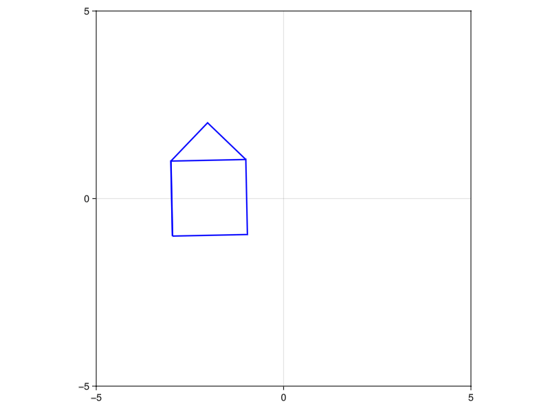

> 7. Simple animation of a shape. Draw a picture of some object (a face, a house, whatever), and make it move around on the screen in a smooth and interesting way. No distortions. Just motions and rotations


In file [./simple_animation.jl](./simple_animation.jl):

```julia
using GLMakie

# Create a figure
fig = Figure(resolution = (800, 600))
ax = GLMakie.Axis(fig[1, 1], aspect = DataAspect())
limits!(ax, -5, 5, -5, 5)

# Define the house vertices (centered at origin)
house_vertices = [
    # Main square
    Point2f(-1, -1), Point2f(1, -1), Point2f(1, 1), Point2f(-1, 1), Point2f(-1, -1),
    # Roof
    Point2f(-1, 1), Point2f(0, 2), Point2f(1, 1)
]

# Create initial lines object
house_lines = lines!(ax, house_vertices, color = :blue, linewidth = 2)

# Animation parameters
frames = 300
angular_speed = 2π/frames  # Complete one rotation
drift_speed = 4/frames    # Total drift distance

# Create the animation
record(fig, "rotating_house.gif", 1:frames; framerate = 30) do frame
    # Calculate rotation and drift
    angle = angular_speed * frame
    drift_x = drift_speed * frame - 2  # Start from left side
    drift_y = sin(2π * frame/frames)   # Add some vertical oscillation
    
    # Apply transformation to each point
    transformed_points = [
        Point2f(
            x * cos(angle) - y * sin(angle) + drift_x,  # Rotation + horizontal drift
            x * sin(angle) + y * cos(angle) + drift_y   # Rotation + vertical oscillation
        )
        for (x, y) in [(p[1], p[2]) for p in house_vertices]
    ]
    
    # Update the lines object
    house_lines[1] = transformed_points
end
```

Produces this animation:


