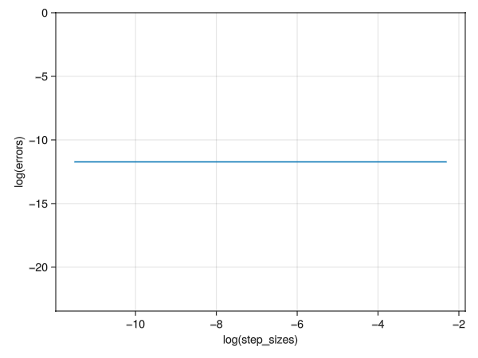

> 8. Simplest dynamics with Polar coordinates. This is the simplest dynamics problem, but posed in polar coordinates. Assume a particle is on a plane with no force on it. So, you know it moves at constant speed in a constant direction.
>     a. Write the differential equations $\vec{a} = \vec{0}$ in polar coordinates.
>     b. Solve them numerically for various initial conditions.
>     c. Plot the solution and check that the motion is a straight line at constant speed.
>     d. Using your numerical result, pick a way to measure how straight the path is, and see how straight a line your polar coordinate solution gives. You should define a quantitative measure of straightness, and then measure it with your solution. e. Is the path more straight when you refine the numerical tolerances.

# a. Write differential equations in polar form

We finally get:

$$\vec{a} = (\ddot{r} - r\omega^2)\hat{e}_r + (2\dot{r}\omega + r\dot{\omega})\hat{e}_\theta = \vec{0}$$

We can break this down into two scalar differential equations of non-unity order, 

$$ \ddot{r} - r\omega^2 = 0 $$

$$ 2\dot{r}\omega + r \dot{\omega} = 0 $$

Rearranging the terms

$$ \ddot{r} =  r\omega^2 $$

$$ \dot{\omega} = - 2r^{-1}v_r\omega $$

introducing the state variable in the following way to reduce this into a first order vector differential equation, also we include $\theta$ to able to track it:

$$\vec{z} = 
\begin{bmatrix}
	\dot{r} \\
    \dot{v_r} \\
    \dot{\theta} \\
    \dot{\omega}
\end{bmatrix}
= 
\begin{bmatrix}
	v_r \\
    r\omega^2 \\
    \omega \\
    - 2r^{-1}v_r\omega \\
\end{bmatrix}
$$

The corresponding code for this ODE in file [./SimplestDynamicsPolar/src/SimplestDynamicsPolar.jl](./SimplestDynamicsPolar/src/SimplestDynamicsPolar.jl):

```julia
# Physics: ODE
function aceleration_zero_polar!(du, u, p, t)
    r  = u[1]
    vᵣ = u[2] 
    θ  = u[3]
    ω  = u[4]

    du[1] = vᵣ
    du[2] = r * ω^2
    du[3] = ω
    du[4] = -2 * r^(-1) * vᵣ * ω
end
```

# b. Solve them numerically for various initial conditions

Some trajectories and some animations for various initial sets of initial conditions look indeed like uniform motion.

In file [./SimplestDynamicsPolar/src/SimplestDynamicsPolar.jl](./SimplestDynamicsPolar/src/SimplestDynamicsPolar.jl):

```julia
 # Problem setup
r₀ = 2
θ₀ = π/3
v⃗ = [1;2]

êᵣ = [cos(θ₀); sin(θ₀)]
êₚ = [-sin(θ₀); cos(θ₀)]

vᵣ₀ = dot(v⃗, êᵣ)
vₚ₀ = dot(v⃗ - vᵣ₀ * êᵣ, êₚ)

ω₀ = vₚ₀ / r₀

u₀ = [r₀; vᵣ₀; θ₀; ω₀]
tspan = (0.0, 10.0)
p = nothing

prob = ODEProblem(acceleration_zero_polar!, u₀, tspan, p)

# Numerical solution
Δh = 0.5
sol = solve(prob, saveat=Δh, abstol=1, reltol=1)

```

# c. Plot the solution and check that the motion is a straight line at constant speed.

In file [./SimplestDynamicsPolar/src/SimplestDynamicsPolar.jl](./SimplestDynamicsPolar/src/SimplestDynamicsPolar.jl):

```julia
# Plotting trajectories
function plot_trajectory_makie(sol)
    # Convert solution to matrix form
    sol_matrix = reduce(hcat, sol.u)'
    
    r = sol_matrix[:, 1]
    θ = sol_matrix[:, 3]

    r⃗ = r .* [cos.(θ) sin.(θ)]
    x = r⃗[:, 1]
    y = r⃗[:, 2]
    xlimits = (minimum(x)-5, maximum(x)+5)
    ylimits = (minimum(y)-5, maximum(y)+5)

    ω = sol_matrix[:, 4]
    vᵣ = sol_matrix[:, 2]
    vₚ = ω .* r
    v⃗ = [vᵣ vₚ]
    s = norm.([v⃗[i, :] for i in 1:length(length(v⃗))])
    t = sol.t
    println(typeof(v⃗), size(v⃗), size(t), v⃗)

    # Create figure
    fig = GLMakie.Figure()
    ax1 = GLMakie.Axis(fig[1, 1], xlabel="x", ylabel="y", limits=(xlimits, ylimits), aspect = DataAspect())
    ax2 = GLMakie.Axis(fig[1, 2], xlabel="time", ylabel="speed", aspect = DataAspect())

    GLMakie.lines!(ax1, x, y)
    GLMakie.lines!(ax2, t, s)
    GLMakie.save("problem08-trajectory.png", fig)
    GLMakie.display(fig)
    return nothing
end
plot_trajectory_makie(sol)
```

The plots generated by this:


Left: The position of particle, $x$ vs $y$, Right: The speed of particle, $\|\vec{v}\|$ vs $t$

# d. Define a metric to measure straightness, plot

Just like [problem03](../problem03/README.md), we can either use an analog to `slither`, i.e. the root mean squared error, but that again would require a lot of computer memory, which corresponds to impossibility on my computer, hence the easiest way here is the `tail_match`.

The measure here is the euclidean norm from the expected end point:

$$\mathbf{\hat{p}} = r_0\left(cos(\theta_0)\hat{i} + sin(\theta_0)\hat{j}\right) + \vec{v} \Delta t$$

$$e = \texttt{norm}(\mathbf{\vec{p}}-\mathbf{\hat{p}})$$

The code corresponding to this, in file [./SimplestDynamicsPolar/src/SimplestDynamicsPolar.jl](./SimplestDynamicsPolar/src/SimplestDynamicsPolar.jl):

```julia
# Measuring straightness
function norm_expected_straight_endpoint(p⃗)
    Δt = tspan[2] - tspan[1]
    v⃗_cartesian = vᵣ₀ .* êᵣ₀ + vₚ₀ .* êₚ₀
    p̂ = r₀ .* [cos(θ₀); sin(θ₀)] .+ v⃗_cartesian .* Δt
    s⃗ = p⃗ .- p̂
    e = norm(s⃗)
    return e
end
```

The path is already very straight without refining $\Delta h$:



This sums up my attempt of problem08.
