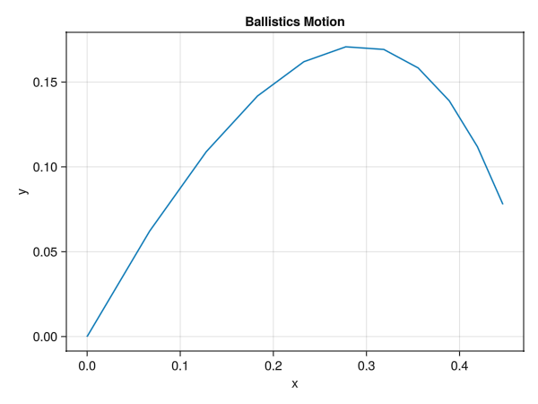

> 9\. Canon ball. A cannon ball m is launched at angle θ and speed v0. It is acted on by gravity g and a viscous drag with magnitude $\|c
\vec{v}\|$.  
>
>     (a) Find position vs time analytically.  
>     (b) Find a numerical solution using θ = π/4, v0 = 1 m/s, g = 1 m/s 2 , m = 1 kg, c = 1 kg/ s.  
>     (c) Compare the numeric and analytic solutions. At t = 2 how big is the error? How does the error depend on specified tolerances or step sizes?  
>     (d) Use larger and larger values of v0 and for each trajectory choose a time interval so the canon at least gets back to the ground. Plot the trajectories (using equal scale for the x and y axis. Plot all curves on one plot. As v → ∞ what is the eventual shape? [Hint: the answer is simple and interesting.]  
>     (e) For any given v0 there is a best launch angle θ ∗ for maximizing the range. As v0 → ∞ to what angle does θ ∗ tend? Justify your answer as best you can with careful numerics, analytical work, or both.  

# Find position vs time analytically.

The corresponding code for this in file [./Ballistics/src/Ballistics.jl](./Ballistics/src/Ballistics.jl):

```julia
function analytical_sol(t)
    m, g, c = p.mass, p.gravity, p.viscosity

    u = zeros((4,))
    u[1] = vx0 * (-c/m) * (exp((-c/m)*(t-t0)) - 1)
    u[2] = ((vy0+(m*g/c))*(-c/m)*(exp((-c/m)*(t-t0)) - 1)) + ((-m*g/c)*(t-t0))
    u[3] = (vx0) * (exp((-c/m)*(t-t0)))
    u[4] = ((vy0) + (m*g/c)) * exp((-c/m)*(t-t0)) - (m*g/c)

    return u
end
```

This turned out to be wrong, it was an integral mistake (integration mistake). The corrected version in the same file:

```julia
function analytical_sol(t)
    m, g, c = p.mass, p.gravity, p.viscosity

    x = x0 + vx0 * ((-m / c) * exp((c / m) * (t0))) * (exp((-c / m) * t) - exp((-c / m) * t0))
    y = y0 + ((vy0 + (m * g / c)) * (-m / c) * (exp((c / m) * t0)) * (exp((-c / m) * t) - exp((-c / m) * t0))) + ((-m * g / c) * (t - t0))
    vx = (vx0) * (exp((-c / m) * (t - t0)))
    vy = ((vy0) + (m * g / c)) * exp((-c / m) * (t - t0)) - (m * g / c)

    u = zeros((4,))
    u[1] = x
    u[2] = y
    u[3] = vx
    u[4] = vy

    return u
end
```

TODO: Could I have created this analytical solution symbolically?

# Find a numerical solution using given parameters

The corresponding code for this in file [./Ballistics/src/Ballistics.jl](./Ballistics/src/Ballistics.jl):

```julia
using DifferentialEquations
#...
# problem setup
x0, y0 = 0.0, 0.0
r0 = [x0; y0]
speed0 = 1
launchangle = pi / 4
vx0, vy0 = speed0 * [cos(launchangle); sin(launchangle)]
v0 = [vx0; vy0]
u0 = [r0; v0]

t0 = 0.0
tend = 1.0
tspan = (t0, tend)
p = Parameters.Param(m=1, g=1, c=1)
prob = ODEProblem(Physics.ballistic!, u0, tspan, p)
#...
sol_numeric = solve(prob)
#...
Visualization.plot_trajectory(sol_numeric.u)
```

This numerical solution gives the following trajectory:



# Compare the numeric and analytics solutions? Plot time vs error. Plot step size and tolerances vs error.

For various initial conditions, the numeric and analytical solutions on the same graph, I was shifting the analytic in x direction by 0.1 unit to be able view both, otherwise they were overlapping with the default tolerances, but then I ended up using a non-dynamic step size explicit solver:

In file [./Ballistics/src/Benchmarks.jl](./Ballistics/src/Benchmarks.jl):

```julia
module Benchmarks

using DifferentialEquations
using LinearAlgebra

# Abs error for various step sizes
function abs_error_vs_step_sizes(prob, analytical_solve)
    # step_sizes = 10.0 .^ range(-1, -15, step=-1)
    step_sizes = 10.0 .^ range(-1, -5, step=-1)
    abs_errors_midpoint = Vector{Union{Missing, Float64}}(missing, length(step_sizes))
    abs_errors_rk4 = Vector{Union{Missing, Float64}}(missing, length(step_sizes))

    for (i,Δh) in enumerate(step_sizes)
        sol_numeric_midpoint = solve(prob, Midpoint(), dt=Δh, adaptive=false, save_everystep=false)[end]
        sol_numeric_rk4 = solve(prob, RK4(), dt=Δh, adaptive=false, save_everystep=false)[end]
        tend = prob.tspan[2]
        sol_analytic = analytical_solve(tend)

        separation_midpoint = sol_numeric_midpoint - sol_analytic
        separation_rk4 = sol_numeric_rk4 - sol_analytic
        error_midpoint = norm(separation_midpoint)
        error_rk4 = norm(separation_rk4)
    
        abs_errors_midpoint[i] = error_midpoint
        abs_errors_rk4[i] = error_rk4
    end

    log_errors_midpoint = log10.(abs_errors_midpoint)
    log_errors_rk4 = log10.(abs_errors_rk4)
    log_errors_dict = Dict("midpoint"=>log_errors_midpoint, "rk4"=> log_errors_rk4)
    log_steps = log10.(step_sizes)

    return log_steps, log_errors_dict
end

# Abs error for all times
function error_vs_time(prob, analytical_solve)
    N = 5
    step_sizes = 10.0 .^ range(-1, -N, step=-1)
    time_histories = Vector{Union{Missing, Vector{Float64}}}(missing, length(step_sizes))
    error_histories = Vector{Union{Missing, Vector{Float64}}}(missing, length(step_sizes))
    for (i,Δh) in enumerate(step_sizes)
        sol = solve(prob, Midpoint(), dt=Δh, adaptive=false, save_everystep=true)

        timestamps = sol.t
        sol_numeric_midpoint = sol.u
        sol_analytic = analytical_solve.(timestamps)

        separations = sol_numeric_midpoint .- sol_analytic
        manhatten_errors = norm.(separations, Ref(1))
        error_histories[i] = log10.(manhatten_errors)
        time_histories[i] = timestamps
    end
    return time_histories, error_histories
end


end # module Benchmarks
```
 


Now, I will plot the steps sizes vs error (euclidean norm of state vector at tend):


For a better method, like RK4, on the same graph:


Now, for time vs error compilation:


Now, I will change the relative tolerance and absolute tolerance. In file [./Ballistics/src/Benchmarks.jl](./Ballistics/src/Benchmarks.jl):

```julia
function tolerances_vs_error(prob, analytical_solve)
    N = 15
    error_matrix = Matrix{Float64}(undef, N, N)
    num_granularity = N+7
    abstols = 10.0 .^ range(7, -N, length=num_granularity)
    reltols = 10.0 .^ range(7, -N, length=num_granularity)

    num_samples = length(abstols)*length(reltols)

    xs = Vector{Float64}(undef, num_samples)
    ys = Vector{Float64}(undef, num_samples)
    zs = Vector{Float64}(undef, num_samples)

    for (i, abstol) in enumerate(abstols)
        for (j, reltol) in enumerate(reltols)
            sol_numeric = solve(prob, Midpoint(), adaptive=true, save_everystep=false, abstol=abstol, reltol=reltol)[end]
            sol_analytic = analytical_solve(prob.tspan[2])

            separation = sol_numeric - sol_analytic
            error = norm(separation)
            xs[i+num_granularity*(j-1)] = abstol
            ys[i+num_granularity*(j-1)] = reltol
            zs[i+num_granularity*(j-1)] = error
        end
    end
    xs,ys,zs
end
```

Just by mistake I ran this for large (>1.0) tolerances. Below is the plot:


Similarly for tiny (<<1.0) tolerances the plot:


Both scales on the same graph:


Simply put, it seems reducing both `abstol` and `reltol` generally reduces error from the analytic solution _very quickly_. What is the meaning of both is not yet entirely clear.

# Use larger and larger values of v0, plot all of their trajectory till ball hits ground. What happens to the eventual shape as v -> ∞ ?

# Plot speed verses best launch angle, numerically or analyticaly or both

This concludes my attempt of problem09.
